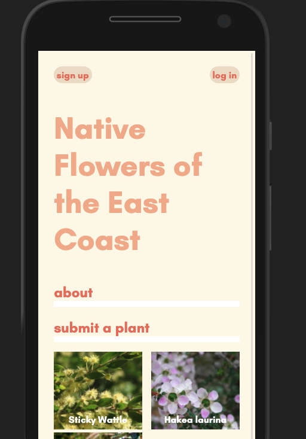

# Native Flowers of the East Coast

https://native-plants.herokuapp.com/

This is a mobile-first app designed to collect data on rare, disappearing and abundant plant species across the East Coast of Australia.

It's early days, but as the app grows, so will the areas covered and the capabilities of the user.

We will soon be implementing a query function to assist when IDing different species.

If you have any comments about the data, please get in touch.

## Project status:

This app is in a testing stage

## Functionality:
* User id
* Login and encrypted PW
* Submission & user history 
* Image upload
* Submission editing
* Mobile friendly
